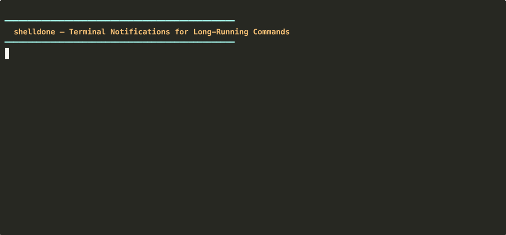

# cli-alert

Cross-platform terminal notification system for long-running commands. Get desktop notifications, sounds, and external alerts (Slack, Discord, Telegram, and more) when your builds, deploys, and tests finish.

> Works with bash and zsh on macOS, Linux, WSL, and Windows. Notify via desktop popup, sound, voice, Slack, Discord, Telegram, Email, WhatsApp, or webhook. Integrates with AI CLIs: Claude Code, Codex, Gemini, Copilot, Cursor, and Aider.

[](https://github.com/nareshnavinash/cli-alert/actions/workflows/ci.yml)
[](LICENSE)
[](VERSION)
[](#platform-support)
[](#installation)
[](#testing)

<!-- TODO: Record with asciinema and embed here -->
<!--  -->

## Table of Contents

- [Features](#features)
- [Quick Start](#quick-start)
- [Installation](#installation)
- [Usage](#usage)
- [Configuration](#configuration)
- [External Notifications](#external-notifications)
- [Commands Reference](#commands-reference)
- [Architecture](#architecture)
- [Platform Support](#platform-support)
- [Troubleshooting](#troubleshooting)
- [Testing](#testing)
- [Alternatives](#alternatives)
- [Contributing](#contributing)
- [License](#license)

## Features

- **Desktop notifications** on macOS, Linux, WSL, and Windows (Git Bash/MSYS2/Cygwin)
- **Auto-notify** for any command that runs longer than a configurable threshold (default: 30s)
- **Sound alerts** with customizable success/failure sounds (system sounds or custom file paths)
- **Text-to-speech** announcements (optional)
- **External notifications** via Slack, Discord, Telegram, Email, WhatsApp, or generic webhooks
- **AI CLI integration** — Claude Code, Codex CLI, Gemini CLI, Copilot CLI, Cursor (hook-based), plus Aider (wrapper)
- **Smart focus detection** — suppresses notifications when you're already looking at the terminal
- **Glob-based exclusions** — skip commands like `npm*`, `ssh`, `vim`, etc.
- **Notification control** — mute, toggle layers (sound/desktop/voice/channels), schedule quiet hours
- **Shell completions** for bash and zsh
- **Zero dependencies** — uses only built-in system tools (`curl`/`wget` optional for external channels)

## Quick Start

```bash
# Clone and install
git clone https://github.com/nareshnavinash/cli-alert.git
cd cli-alert
./install.sh

# Verify your setup
cli-alert status

# Send a test notification
cli-alert test-notify

# Wrap any command
alert make build
```

After installation, commands running longer than 30 seconds automatically trigger notifications — no wrapper needed.

## Installation

### From Source (recommended)

```bash
git clone https://github.com/nareshnavinash/cli-alert.git
cd cli-alert
./install.sh
```

The install script detects your platform, makes scripts executable, adds shell integration to your rc files, and sets up hooks for all detected AI CLIs.

### Make Install

```bash
make install                     # installs to /usr/local
make install PREFIX=~/.local     # installs to ~/.local
```

### Homebrew (macOS/Linux) — Coming Soon

No Homebrew tap has been published yet. To install from the local formula using HEAD:

```bash
brew install --HEAD ./Formula/cli-alert.rb
```

A `brew install cli-alert` command will be available once a tap repository and GitHub release are created.

### Debian/Ubuntu — Coming Soon

No `.deb` package has been published yet. The release workflow builds one automatically when a version tag is pushed. To build locally:

```bash
make install PREFIX=/usr/local
```

### Scoop (Windows) — Coming Soon

The Scoop manifest is not yet published to any bucket. Install from source on Windows (Git Bash/MSYS2) using `make install` or `./install.sh`.

### Chocolatey (Windows) — Coming Soon

The Chocolatey package is not yet published. Install from source on Windows (Git Bash/MSYS2) using `make install` or `./install.sh`.

### Manual Setup

Add to your `.zshrc` or `.bashrc`:

```bash
eval "$(cli-alert init zsh)"    # for zsh
eval "$(cli-alert init bash)"   # for bash
```

Or auto-configure everything (rc files + AI CLI hooks):

```bash
cli-alert setup
```

## Usage

### `alert <command>` — Explicit Notifications

Wrap any command to get notified when it completes:

```bash
alert make build
alert npm test
alert ./deploy.sh production
alert docker compose up --build
```

The notification shows the command name, exit status icon, elapsed time, and exit code. The original exit code is preserved:

```bash
alert false
echo $?   # prints 1
```

### Automatic Notifications

After shell integration, any command running longer than the threshold (default: 30 seconds) triggers a notification automatically. No `alert` wrapper needed.

```bash
# Just run your command normally
make build-all    # takes 5 minutes -> notification fires
npm install       # takes 2 minutes -> notification fires
ls                # instant -> no notification
vim file.txt      # excluded by default -> no notification
```

Auto-notify uses `preexec`/`precmd` hooks in zsh and `DEBUG` trap + `PROMPT_COMMAND` in bash.

### AI CLI Integration

cli-alert can notify you when AI coding assistants finish their turn. It supports Claude Code, Codex CLI, Gemini CLI, GitHub Copilot CLI, and Cursor via native hook systems, plus Aider via the `alert` wrapper.

```bash
# Install hooks for all detected AI CLIs
cli-alert setup ai-hooks

# Or install individually
cli-alert setup claude-hook     # Claude Code (~/.claude/settings.json)
cli-alert setup codex-hook      # Codex CLI (~/.codex/config.json)
cli-alert setup gemini-hook     # Gemini CLI (~/.gemini/settings.json)
cli-alert setup copilot-hook    # Copilot CLI (~/.github/hooks/)
cli-alert setup cursor-hook     # Cursor (~/.cursor/hooks.json)
```

Each hook script reads a JSON event from stdin, extracts the relevant metadata, and triggers a notification. You can toggle notifications per AI CLI:

```bash
cli-alert toggle claude off     # disable Claude notifications
cli-alert toggle codex on       # re-enable Codex notifications
```

#### Aider

Aider does not support native hooks. Use the `alert` wrapper instead:

```bash
alert aider "fix the login bug"
```

### Exclusion Patterns

Commands matching exclusion patterns are silently skipped by auto-notify. Patterns support shell globs:

```bash
export CLI_ALERT_EXCLUDE="vim nvim ssh npm* docker*"
```

Manage exclusions interactively:

```bash
cli-alert exclude list            # show current exclusions
cli-alert exclude add docker      # prints export line to add
cli-alert exclude remove vim      # prints updated export line
```

Default exclusions: `vim nvim vi nano less more man top htop ssh tmux screen fg bg watch`

### Notification Control

Temporarily mute, toggle notification layers, or schedule quiet hours:

```bash
# Mute all notifications
cli-alert mute           # indefinitely
cli-alert mute 30m       # for 30 minutes
cli-alert mute 2h        # for 2 hours
cli-alert unmute          # resume

# Toggle individual layers
cli-alert toggle sound off      # disable sound, keep desktop popups
cli-alert toggle voice off      # disable TTS
cli-alert toggle slack off      # disable Slack channel
cli-alert toggle external off   # disable all external channels
cli-alert toggle                # show all toggle states

# Schedule daily quiet hours (crosses midnight OK)
cli-alert schedule 22:00-08:00
cli-alert schedule off          # clear schedule
```

Supported layers: `desktop`, `sound`, `voice`, `slack`, `discord`, `telegram`, `email`, `whatsapp`, `webhook`, `external` (group toggle), `claude`, `codex`, `gemini`, `copilot`, `cursor` (AI CLIs).

Quiet hours can also be set via environment variable:

```bash
export CLI_ALERT_QUIET_HOURS="22:00-08:00"
```

When muted or in quiet hours, notifications are suppressed but still logged to history.

## Configuration

All settings are environment variables. Set them before the `eval` line in your shell config:

```bash
# Example .zshrc
export CLI_ALERT_THRESHOLD=60
export CLI_ALERT_SOUND_SUCCESS=Ping
export CLI_ALERT_VOICE=true
eval "$(cli-alert init zsh)"
```

### General Settings

| Variable | Default | Description |
|---|---|---|
| `CLI_ALERT_ENABLED` | `true` | Master on/off switch |
| `CLI_ALERT_AUTO` | `true` | Auto-notify on/off |
| `CLI_ALERT_THRESHOLD` | `10` | Seconds before auto-notify triggers |
| `CLI_ALERT_DEBUG` | *(off)* | Set to `true` for debug output to stderr |

### Sound Settings

| Variable | Default | Description |
|---|---|---|
| `CLI_ALERT_SOUND_SUCCESS` | `Glass` (macOS), `complete` (Linux), `Asterisk` (Windows) | Success sound name or file path |
| `CLI_ALERT_SOUND_FAILURE` | `Sosumi` (macOS), `dialog-error` (Linux), `Hand` (Windows) | Failure sound name or file path |
| `CLI_ALERT_SOUND_TIMEOUT` | `10` | Max seconds to wait for sound playback |
| `CLI_ALERT_VOICE` | *(off)* | Set to `true` for TTS announcements |

Use a system sound name or a file path:

```bash
export CLI_ALERT_SOUND_SUCCESS=Ping
export CLI_ALERT_SOUND_FAILURE=/path/to/custom/error.aiff
```

List available sounds: `cli-alert sounds`

### Focus & Exclusion Settings

| Variable | Default | Description |
|---|---|---|
| `CLI_ALERT_FOCUS_DETECT` | `true` | Suppress notifications when terminal is focused |
| `CLI_ALERT_TERMINALS` | `Terminal iTerm2 Alacritty kitty WezTerm Hyper` | Terminal app names for focus detection (macOS) |
| `CLI_ALERT_EXCLUDE` | `vim nvim vi nano less more man top htop ssh tmux screen fg bg watch` | Space-separated commands/globs to skip |

### Notification Control Settings

| Variable | Default | Description |
|---|---|---|
| `CLI_ALERT_QUIET_HOURS` | *(off)* | Daily quiet hours (e.g., `22:00-08:00`, crosses midnight OK) |
| `CLI_ALERT_HISTORY` | `true` | Log notifications to history file |

## External Notifications

Get notified on Slack, Discord, Telegram, email, WhatsApp, or any webhook endpoint. External notifications fire even when the terminal is focused — ideal for monitoring from your phone or another device.

### Slack

1. Go to [api.slack.com/apps](https://api.slack.com/apps) > Create New App > From scratch
2. Enable **Incoming Webhooks** > Activate > **Add New Webhook to Workspace**
3. Select a channel and copy the webhook URL

```bash
export CLI_ALERT_SLACK_WEBHOOK="https://hooks.slack.com/services/T.../B.../xxx"
```

Optional:

```bash
export CLI_ALERT_SLACK_USERNAME="my-bot"     # default: cli-alert
export CLI_ALERT_SLACK_CHANNEL="#alerts"      # override channel
```

### Discord

1. Open Server Settings > Integrations > Webhooks > **New Webhook**
2. Select a channel, copy the webhook URL

```bash
export CLI_ALERT_DISCORD_WEBHOOK="https://discord.com/api/webhooks/..."
```

Optional:

```bash
export CLI_ALERT_DISCORD_USERNAME="my-bot"   # default: cli-alert
```

### Telegram

1. Message [@BotFather](https://t.me/BotFather) > `/newbot` > copy the bot token
2. Send a message to your bot, then get your chat ID:
   ```bash
   curl -s "https://api.telegram.org/bot<TOKEN>/getUpdates" | grep -o '"id":[0-9]*' | head -1
   ```

```bash
export CLI_ALERT_TELEGRAM_TOKEN="123456:ABC-DEF..."
export CLI_ALERT_TELEGRAM_CHAT_ID="your-chat-id"
```

### Email

Requires `sendmail` or `mail` command on the system.

```bash
export CLI_ALERT_EMAIL_TO="you@example.com"
```

Optional:

```bash
export CLI_ALERT_EMAIL_FROM="alerts@myhost.com"        # default: cli-alert@<hostname>
export CLI_ALERT_EMAIL_SUBJECT="[deploy] finished"     # default: [cli-alert] <title>
```

### WhatsApp (via Twilio)

```bash
export CLI_ALERT_WHATSAPP_API_URL="https://api.twilio.com/2010-04-01/Accounts/.../Messages.json"
export CLI_ALERT_WHATSAPP_TOKEN="base64-encoded-sid:token"
export CLI_ALERT_WHATSAPP_FROM="+14155238886"
export CLI_ALERT_WHATSAPP_TO="+1234567890"
```

All four variables are required.

### Generic Webhook

```bash
export CLI_ALERT_WEBHOOK_URL="https://your-endpoint.com/hook"
export CLI_ALERT_WEBHOOK_HEADERS="Authorization: Bearer token123|X-Custom: value"  # optional, pipe-separated
```

The webhook receives a JSON payload:

```json
{
  "title": "make Complete",
  "message": "✓ make build (2m 15s, exit 0)",
  "exit_code": 0
}
```

### Persisting Channel Configuration (Important for AI CLI Hooks)

AI CLI hooks (Claude Code, Codex, Gemini, Copilot, Cursor) run as **separate processes** spawned by the AI tool — they do **not** inherit your shell's environment variables. If you only set a webhook via `export` in your terminal, `cli-alert webhook test slack` will work from that shell, but hooks triggered by AI CLIs will not have the variable.

There are two ways to ensure hooks can access your channel configuration:

**Option 1: Config file (recommended)**

Add your webhook URLs to `~/.config/cli-alert/config`. Hooks read this file on every invocation, regardless of environment:

```bash
cli-alert config edit
# Uncomment and fill in the relevant lines:
# export CLI_ALERT_SLACK_WEBHOOK="https://hooks.slack.com/services/T.../B.../xxx"
```

**Option 2: Shell profile**

Add the `export` to your `.zshrc` or `.bashrc` **before** starting the AI CLI. The AI tool inherits the variable at launch and passes it to hooks:

```bash
# In .zshrc or .bashrc (BEFORE eval "$(cli-alert init zsh)")
export CLI_ALERT_SLACK_WEBHOOK="https://hooks.slack.com/services/T.../B.../xxx"
```

> **Why `export` alone doesn't work:** `export` sets a variable in the current shell and its future children. It cannot update already-running processes. If you export a webhook URL after starting Claude Code, Claude Code's process (and its hooks) won't see it. You'd need to restart the AI CLI for it to pick up the new variable.

### External Notification Settings

| Variable | Default | Description |
|---|---|---|
| `CLI_ALERT_RATE_LIMIT` | `10` | Min seconds between notifications per channel |
| `CLI_ALERT_WEBHOOK_TIMEOUT` | `5` | HTTP timeout in seconds |
| `CLI_ALERT_EXTERNAL_DEBUG` | `false` | Log external notification attempts to stderr |

### Testing & Verifying Channels

```bash
cli-alert webhook status              # show transport, channels, rate limit
cli-alert webhook test slack           # send a test message to Slack
cli-alert webhook test discord         # test Discord
cli-alert webhook test telegram        # test Telegram
cli-alert webhook test email           # test Email
cli-alert webhook test whatsapp        # test WhatsApp
cli-alert webhook test webhook         # test generic webhook
```

The test command validates all required variables upfront, shows success/failure with the HTTP status code, and is not subject to rate limiting:

```
$ cli-alert webhook test slack
Sending test to slack...
[cli-alert] Test sent successfully! (HTTP 200)

$ cli-alert webhook test slack   # with a bad URL
Sending test to slack...
[cli-alert] Test FAILED. (HTTP 403)
[cli-alert] Run with CLI_ALERT_EXTERNAL_DEBUG=true for details.
```

> **Note:** Slack, Discord, Telegram, and WhatsApp require `curl` or `wget` (HTTPS). The generic webhook can use `/dev/tcp` for plain HTTP endpoints if neither is available.

## Commands Reference

| Command | Description |
|---|---|
| `cli-alert init [bash\|zsh]` | Output shell init code (use with `eval`) |
| `cli-alert setup [all\|ai-hooks\|<ai>-hook]` | Auto-configure rc files and/or AI CLI hooks |
| `cli-alert uninstall` | Remove all shell integration and AI CLI hooks |
| `cli-alert status` | Show diagnostic info — platform, tools, config, integration |
| `cli-alert test-notify` | Send a test notification (desktop + all configured external channels) |
| `cli-alert sounds` | List available system sounds for your platform |
| `cli-alert exclude [list\|add\|remove]` | Manage auto-notify exclusion list |
| `cli-alert webhook [status\|test <channel>]` | Manage and test external notification channels |
| `cli-alert mute [duration]` | Mute all notifications (e.g., `30m`, `2h`, `1h30m`) |
| `cli-alert unmute` | Resume notifications |
| `cli-alert toggle [layer [on\|off]]` | Toggle notification layers (sound, desktop, voice, channels) |
| `cli-alert schedule [HH:MM-HH:MM\|off]` | Set or clear daily quiet hours |
| `cli-alert test` | Run the full verification test suite (337 tests) |
| `cli-alert version [--verbose]` | Show version (add `--verbose` for platform details) |
| `cli-alert help` | Show usage help |

## Architecture

### Project Structure

```
cli-alert/
├── bin/cli-alert              # Main CLI executable (dispatch + commands)
├── lib/
│   ├── cli-alert.sh           # Core notification engine + alert() wrapper
│   ├── auto-notify.zsh        # Zsh preexec/precmd auto-notify hooks
│   ├── auto-notify.bash       # Bash DEBUG trap auto-notify hooks
│   ├── external-notify.sh     # External channels (Slack, Discord, etc.)
│   ├── state.sh               # Mute, toggle, and schedule state management
│   └── ai-hook-common.sh      # Shared library for AI CLI hooks
├── hooks/
│   ├── claude-done.sh         # Claude Code Stop hook
│   ├── codex-done.sh          # Codex CLI Stop hook
│   ├── gemini-done.sh         # Gemini CLI command hook
│   ├── copilot-done.sh        # Copilot CLI sessionEnd hook
│   └── cursor-done.sh         # Cursor stop hook
├── completions/
│   ├── cli-alert.bash         # Bash completion
│   └── cli-alert.zsh          # Zsh completion
├── Formula/cli-alert.rb       # Homebrew formula
├── debian/                    # Debian packaging
├── packaging/
│   ├── chocolatey.nuspec      # Chocolatey manifest
│   └── scoop.json             # Scoop manifest
├── install.sh                 # Interactive installer
├── uninstall.sh               # Uninstaller
├── test.sh                    # Test suite (337 tests)
├── Makefile                   # make install/uninstall/test
└── VERSION                    # 0.2.0
```

### Design Principles

- **Multi-path resolution** — Works both from source (`./lib/`) and installed (`/usr/lib/cli-alert/`, `/usr/local/lib/cli-alert/`)
- **Lazy loading** — External notification module loaded at init if a channel env var is set, or on-demand at notification time if configured later
- **Double-source guards** — All lib files check guard variables to prevent re-initialization
- **Marker-based uninstall** — RC file cleanup uses `# >>> cli-alert >>>` / `# <<< cli-alert <<<` markers
- **Timeout safety** — Background sound/TTS processes have watchdog timers to prevent hangs
- **Pure-bash JSON** — JSON escaping without `jq` dependency
- **Rate limiting** — Per-channel rate limits via shared stamp files in `/tmp/`
- **Fallback chain** — Platform notifier > warning > terminal bell + stderr message

### Notification Flow

```
Command completes
  └─> alert() / auto-notify hook
        └─> _cli_alert_notify()
              ├─> Mute / quiet hours check (suppress if active, still logs)
              ├─> External notifications (background, non-blocking)
              │     └─> Slack, Discord, Telegram, Email, WhatsApp, Webhook
              ├─> Focus detection (skip if terminal focused)
              └─> Platform notifier
                    ├─> macOS: osascript + afplay + say
                    ├─> Linux: notify-send + paplay/aplay + espeak
                    ├─> WSL: BurntToast/WinRT + powershell.exe
                    └─> Fallback: terminal bell + stderr
```

## Platform Support

| Feature | macOS | Linux | WSL | Windows (Git Bash) |
|---|---|---|---|---|
| Desktop notifications | osascript | notify-send | BurntToast / WinRT | BurntToast / WinRT |
| Sound | afplay | paplay / aplay / mpv | powershell.exe | powershell.exe |
| TTS | say | espeak / spd-say | powershell.exe | powershell.exe |
| Focus detection | AppleScript | xdotool | -- | -- |
| Auto-notify | zsh + bash | zsh + bash | zsh + bash | bash |
| External notifications | All channels | All channels | All channels | All channels |
| Fallback | terminal bell | terminal bell | terminal bell | terminal bell |

### Platform Dependencies

**macOS:** No additional dependencies (osascript, afplay, say are built-in).

**Linux:**
- Desktop notifications: `libnotify-bin` (`apt install libnotify-bin`)
- Sound: `pulseaudio-utils` (paplay) or `alsa-utils` (aplay)
- TTS: `espeak` or `speech-dispatcher` (spd-say)
- Focus detection: `xdotool`

**WSL/Windows:**
- [BurntToast](https://github.com/Windos/BurntToast) PowerShell module (recommended) or `wsl-notify-send`

**External channels:** `curl` or `wget` for HTTPS channels (Slack, Discord, Telegram, WhatsApp).

## Troubleshooting

### Quick Diagnosis

```bash
cli-alert status
```

This shows your platform, available notification tools, current config, shell integration status, Claude Code hook status, and external channel configuration.

### Debug Mode

**Desktop notifications:**

```bash
export CLI_ALERT_DEBUG=true
alert echo hello
```

Prints detailed debug output to stderr showing platform detection, notification routing, and sound playback.

**External notifications:**

```bash
export CLI_ALERT_EXTERNAL_DEBUG=true
alert echo hello
```

Prints HTTP transport selection, POST targets (URLs redacted), and per-channel success/failure with HTTP status codes.

### Common Issues

**No notification appears:**
- Run `cli-alert status` to check notification tools are available
- Run `cli-alert test-notify` to send a test notification
- On macOS: check System Settings > Notifications for terminal app permissions
- On Linux: install `libnotify-bin` (`apt install libnotify-bin`)

**No sound plays:**
- Run `cli-alert sounds` to see available sounds
- Check that the sound file exists: `ls /System/Library/Sounds/` (macOS)
- Try a custom path: `export CLI_ALERT_SOUND_SUCCESS=/path/to/sound.aiff`

**Auto-notify not working:**
- Ensure `CLI_ALERT_AUTO=true` (default)
- Check threshold: `CLI_ALERT_THRESHOLD=10` means commands must run 10+ seconds
- Check exclusions: `cli-alert exclude list`
- Ensure shell integration is loaded: `cli-alert status` shows rc file status

**External notifications not arriving:**
- Run `cli-alert webhook status` to verify channel config
- Test a specific channel: `cli-alert webhook test slack`
- Enable debug output: `export CLI_ALERT_EXTERNAL_DEBUG=true`
- Ensure `curl` or `wget` is installed (required for HTTPS channels)
- Check for HTTP errors: test output shows the HTTP status code on failure
- Verify rate limiting isn't blocking: default is 10 seconds between notifications per channel

**External notifications work from shell but not from AI CLI hooks:**
- AI hooks run as separate processes that don't inherit your shell's `export` variables
- Persist your webhook URL in the config file: `cli-alert config edit` (uncomment the relevant line)
- Or add the `export` to `.zshrc`/`.bashrc` and **restart the AI CLI** so it inherits the variable
- See [Persisting Channel Configuration](#persisting-channel-configuration-important-for-ai-cli-hooks) for details

**AI CLI hooks not firing:**
- Run `cli-alert status` to check hook installation for all AI CLIs
- Re-install a specific hook: `cli-alert setup claude-hook` (or `codex-hook`, `gemini-hook`, etc.)
- Re-install all: `cli-alert setup ai-hooks`
- Verify the AI CLI's settings file contains the hook entry
- Requires `python3` for installation (hooks use it for JSON parsing)
- Check per-AI toggle: `cli-alert toggle` shows if a hook is toggled off

**Focus detection suppressing notifications:**
- Disable: `export CLI_ALERT_FOCUS_DETECT=false`
- Or add your terminal to the detection list: `export CLI_ALERT_TERMINALS="Terminal iTerm2 Alacritty MyTerminal"`
- Note: focus detection only works on macOS (AppleScript) and Linux (xdotool)

## Testing

cli-alert includes a comprehensive test suite with 337 tests covering unit, integration, and end-to-end scenarios.

```bash
# Run from project root
bash test.sh

# Or via the CLI
cli-alert test
```

### Test Categories

| Category | Tests | Coverage |
|---|---|---|
| Platform detection | 1 | Platform identification |
| CLI entry point | 5 | Binary, version, help, init |
| Core functions | 7 | Function existence checks |
| Duration formatting | 3 | Seconds, minutes, hours |
| Alert wrapper | 4 | Success, failure, exit code preservation |
| AppleScript sanitization | 3 | Quote/backslash escaping |
| Exit code validation | 3 | Non-numeric, empty, valid |
| Status icon | 4 | UTF-8 and ASCII variants |
| Notification delivery | 1 | Desktop notification send |
| Sound playback | 1 | Sound file existence |
| Claude Code hook | 2 | Script executable, JSON processing |
| AI Hook Common Library | 8 | Source guard, JSON extraction, functions |
| AI Hook Scripts | 12 | Codex, Gemini, Copilot, Cursor: executable, JSON, empty stdin |
| AI Hook Setup CLI | 8 | Setup subcommands, help text |
| AI Hook Setup Append Safety | 8 | Preserves existing hooks, idempotency, non-hook settings |
| AI Hook Toggle | 6 | Per-AI toggle on/off, state persistence |
| AI Hook Status | 4 | Status output includes AI section |
| CLI commands | 8 | status, test-notify, sounds, exclude, version |
| Dynamic title | 1 | alert() title generation |
| Warning function | 2 | Existence, deduplication |
| Focus detection | 2 | Existence, disable flag |
| Glob exclusion | 3 | Exact, glob match, no false positive |
| JSON escaping | 10 | Plain, quotes, backslashes, newlines, tabs, edge cases |
| Rate limiting | 8 | Cycle, no stamp, fresh, expired, skip, independent, custom |
| HTTP transport | 2 | Detection, unknown transport |
| External functions | 1 | All channel functions exist |
| URL redaction | 4 | Path strip, no path, non-HTTP |
| HTTP status capture | 16 | 2xx success, 3xx/4xx/5xx failure, network errors, headers |
| Channel validation | 17 | All channels: missing/present vars, unknown channel |
| Channel error handling | 18 | Success/failure returns, rate limit behavior per channel |
| Channel payloads | 10 | Colors, usernames, headers, JSON escaping, structure |
| Debug output | 3 | Failure messages, success messages, silent mode |
| URL parsing | 4 | HTTPS, HTTP, custom port, invalid scheme |
| CLI webhook test (E2E) | 15 | Validation errors, mock HTTP success/failure, rate limit bypass |
| Background dispatch | 3 | Channel routing, debug stderr, non-debug swallow |
| CLI webhook status (E2E) | 5 | Transport, rate limit, channels, timeout, bad action |

### CI

The project runs CI via GitHub Actions (`.github/workflows/ci.yml`):

1. **ShellCheck** — lints all shell scripts
2. **Test macOS** — runs test suite under both `bash` and `zsh`
3. **Test Linux** — installs dependencies, runs test suite
4. **Test Install** — full install/verify/uninstall roundtrip

## Uninstalling

```bash
# Via the CLI (recommended)
cli-alert uninstall

# Or run the uninstall script
./uninstall.sh

# Or via make
make uninstall
```

This removes shell integration from `.zshrc` and `.bashrc`, and removes all AI CLI hooks (Claude, Codex, Gemini, Copilot, Cursor).

## Alternatives

| Feature | cli-alert | undistract-me | noti | done (fish) |
|---|---|---|---|---|
| Auto-notify | Yes | Yes | Partial | Yes |
| macOS + Linux + WSL + Windows | Yes | No | Yes | No |
| External channels (6) | Yes | No | Partial | No |
| Zero dependencies | Yes | Yes | No (Go) | Yes |
| AI CLI integration (5 tools) | Yes | No | No | No |
| Sound + TTS | Yes | No | Partial | No |
| Mute / schedule / toggle | Yes | No | No | No |

## Contributing

1. Fork the repository
2. Create a feature branch: `git checkout -b feature/my-feature`
3. Make your changes
4. Run the test suite: `bash test.sh` (all 337 tests must pass)
5. Run ShellCheck: `shellcheck bin/cli-alert lib/*.sh hooks/*.sh`
6. Commit and push
7. Open a pull request

### Adding a New External Channel

1. Add the channel function `_cli_alert_external_<name>()` in `lib/external-notify.sh`
2. Wrap the HTTP call in `if _cli_alert_http_post ...; then ... else ... fi` pattern
3. Add validation to `_cli_alert_validate_channel()`
4. Add dispatch line in `_cli_alert_notify_external()`
5. Add status display in `cmd_webhook` status block (`bin/cli-alert`)
6. Add tests (unit, integration, E2E) in `test.sh`
7. Document in README

## License

MIT License. Copyright (c) 2026 Naresh Sekar. See [LICENSE](LICENSE) for details.
